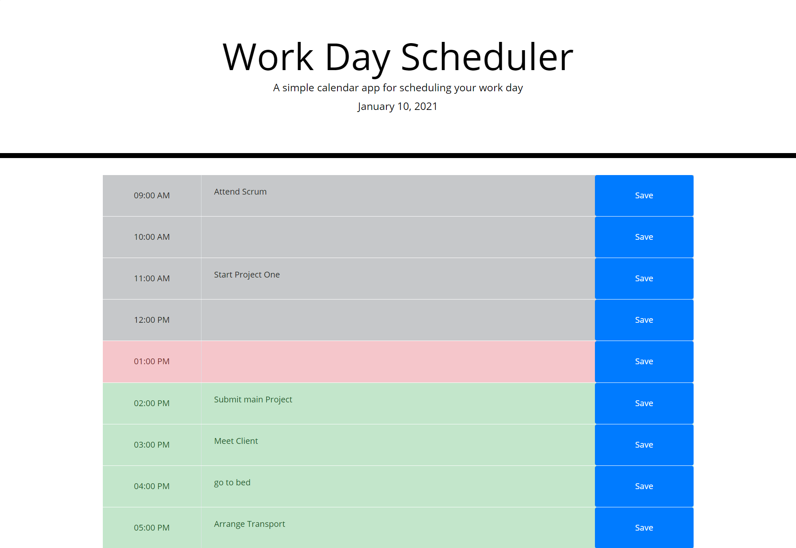

# Work Day Scheduler
# Screenshot:

## This is a daily planner to create a schedule for the day office hours (9am - 5pm)
## Current day is displayed at the top calendar with momentjs
## Time blocks created as list items for the day
## Time block is color-coded to indicate whether it is in the past, present, or future (grey/red/green)
## Clicking into time block to enter an event
## After entering or updating time block click save button to save event in local storage
## Data remains even after refresing the page
## HTML elements updated dynamically and bootsrap components added
## Tasks element shown in p element which converted to textarea dynamically on click

link to the site: https://ryan7998.github.io/work-day-scheduler/